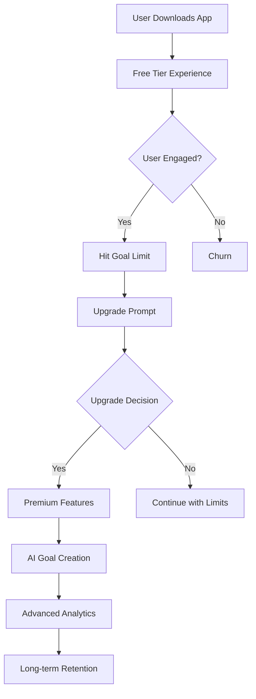
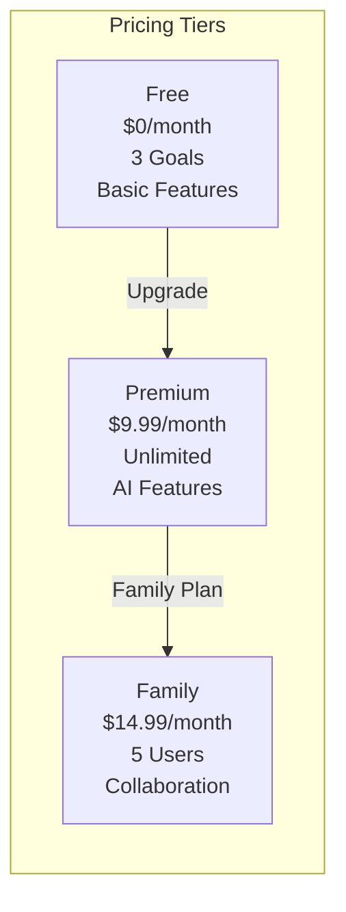
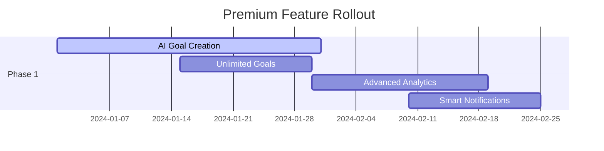
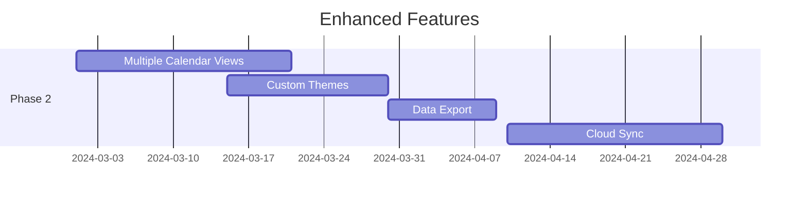
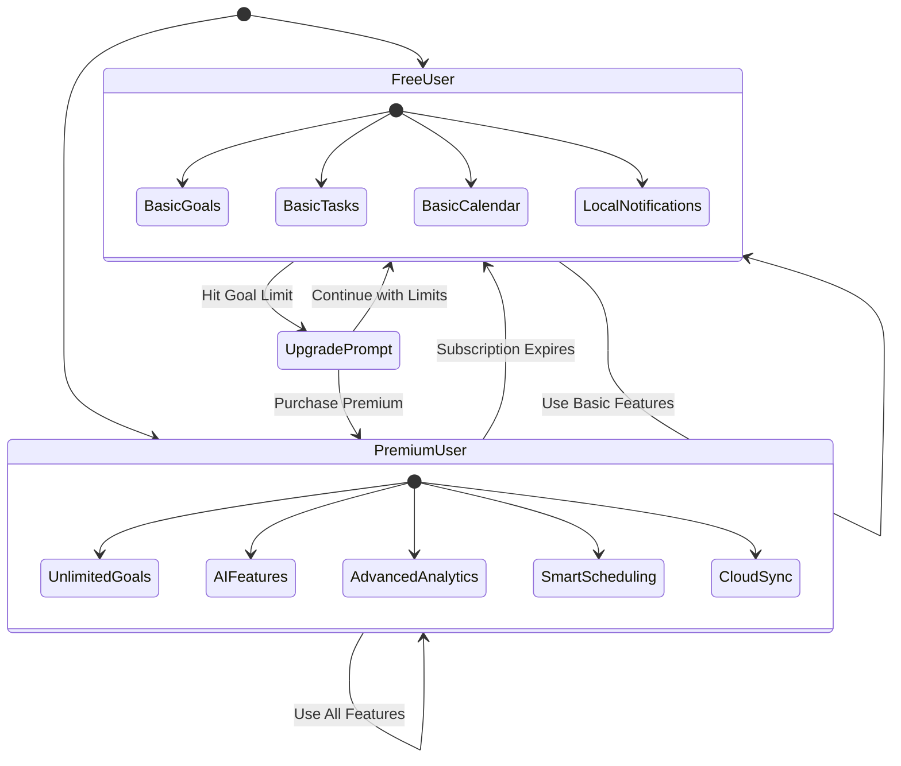
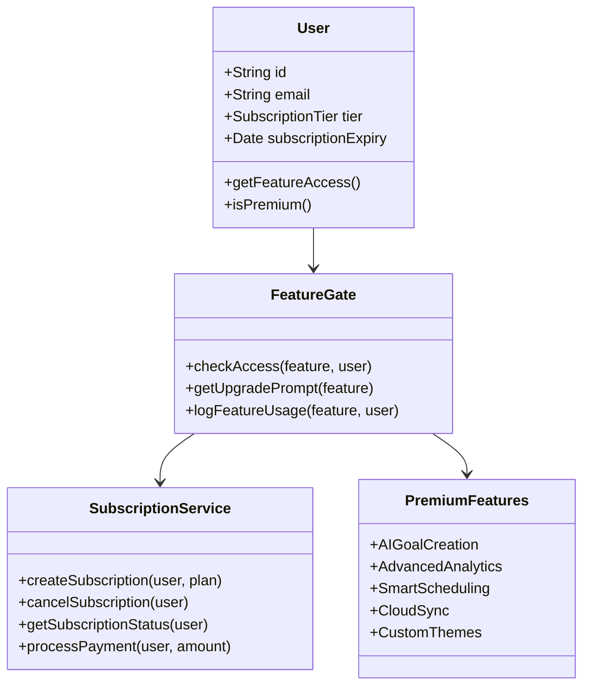
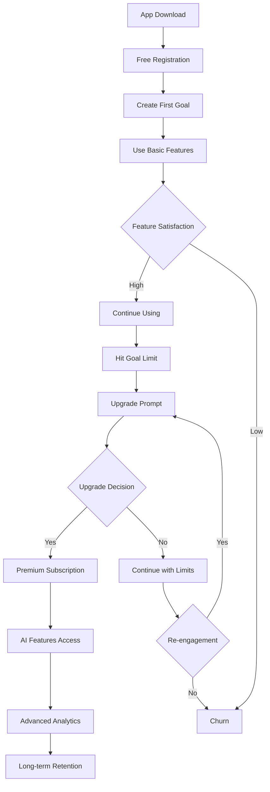

# Momentum App - Premium vs Free Feature Strategy

## 🎯 Feature Tiers Overview

```mermaid
graph TB
    subgraph "🆓 FREE TIER"
        F1[3 Active Goals]
        F2[Basic Goal Creation]
        F3[Goal Progress Tracking]
        F4[Basic Task Management]
        F5[Basic Calendar View]
        F6[Local Notifications]
        F7[Dark/Light Theme]
        F8[Basic Dashboard]
    end
    
    subgraph "💎 PREMIUM TIER"
        P1[Unlimited Goals]
        P2[AI Goal Creation]
        P3[AI Chat Coach]
        P4[Advanced Analytics]
        P5[Multiple Calendar Views]
        P6[Smart Scheduling]
        P7[Custom Themes]
        P8[Cloud Sync]
        P9[Data Export]
        P10[Priority Support]
    end
    
    F1 --> P1
    F2 --> P2
    F3 --> P4
    F5 --> P5
    F7 --> P7
```

## 📊 Feature Comparison Matrix

| Feature Category | Free Tier | Premium Tier |
|------------------|-----------|--------------|
| **Goal Management** | 3 active goals, basic creation | Unlimited goals, AI creation |
| **AI Features** | None | Full AI assistant & coaching |
| **Analytics** | Basic progress bars | Advanced insights & reports |
| **Calendar** | Month view only | All views + smart scheduling |
| **Notifications** | Local, basic timing | Smart notifications + push |
| **Themes** | Dark/Light only | Custom themes |
| **Sync** | Local storage only | Cloud sync |
| **Support** | Community support | Priority support |

## 🎯 User Journey Flow

## 💰 Pricing Strategy

## 🚀 Implementation Phases

### Phase 1: Core Premium Features

### Phase 2: Enhanced Experience

## 🎯 Feature Access Control

## 📱 Feature Implementation Architecture

## 🎯 Conversion Funnel

## 📊 Success Metrics

### Free Tier Metrics
- **Goal Creation Rate**: Track how quickly users create their first 3 goals
- **Feature Usage**: Monitor which free features are most used
- **Time to Goal Limit**: Measure how long until users hit the 3-goal limit
- **Retention Rate**: Track 7-day, 30-day retention for free users

### Premium Tier Metrics
- **Conversion Rate**: Free to premium conversion percentage
- **AI Feature Adoption**: Usage of AI goal creation and chat
- **Advanced Feature Usage**: Analytics, smart scheduling adoption
- **Subscription Retention**: Monthly churn rate for premium users

### Revenue Metrics
- **Monthly Recurring Revenue (MRR)**: Track subscription revenue
- **Average Revenue Per User (ARPU)**: Revenue per user calculation
- **Customer Lifetime Value (CLV)**: Long-term revenue per user
- **Churn Rate**: Monthly subscription cancellation rate

## 🎯 Marketing Positioning

### Free Tier Value Proposition
- "Start your goal-tracking journey"
- "Perfect for personal productivity"
- "Core features included forever"

### Premium Tier Value Proposition
- "Unlock AI-powered goal creation"
- "Unlimited goals & advanced insights"
- "Professional-grade productivity tools"
- "Smart scheduling & analytics"

## 🔧 Technical Implementation Notes

### Feature Gating
- Implement feature flags for premium features
- Use subscription status to control access
- Graceful degradation for expired subscriptions
- Clear upgrade prompts with value messaging

### Analytics Tracking
- Track feature usage by subscription tier
- Monitor conversion funnel metrics
- A/B test upgrade prompts and pricing
- Measure feature adoption rates

### Payment Integration
- Stripe/Apple Pay/Google Pay integration
- Subscription management
- Proration handling for upgrades
- Grace period for failed payments
