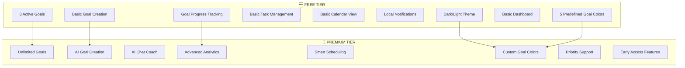
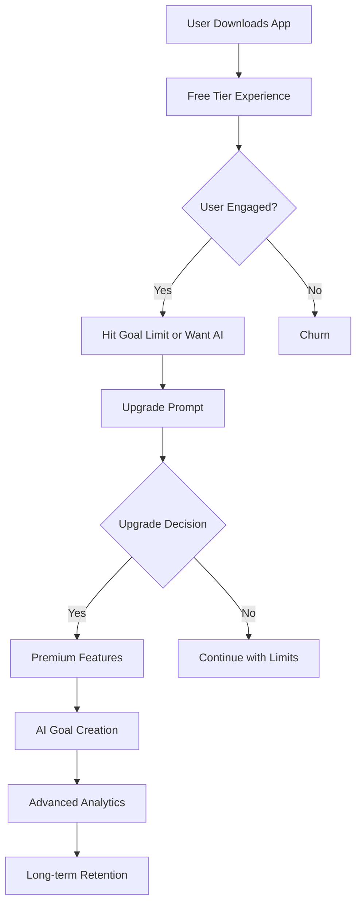
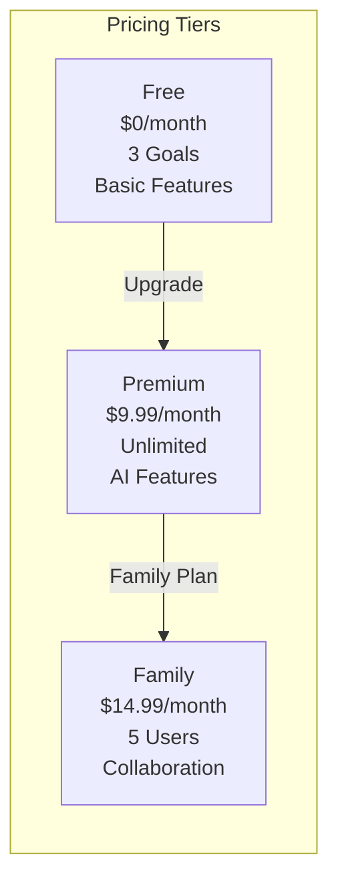
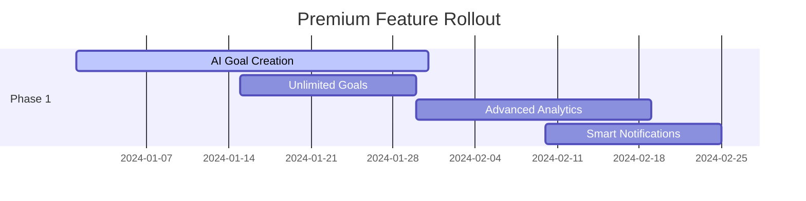
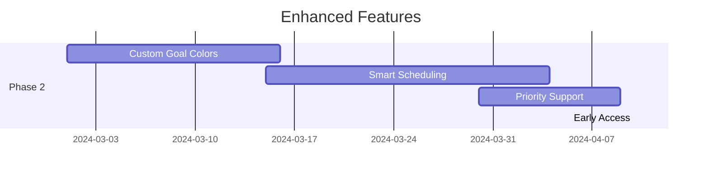
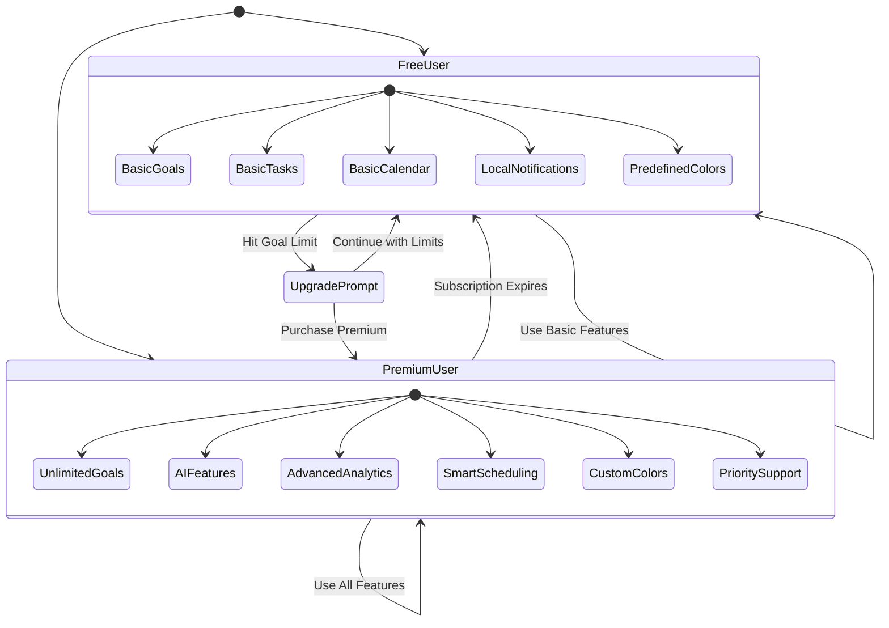
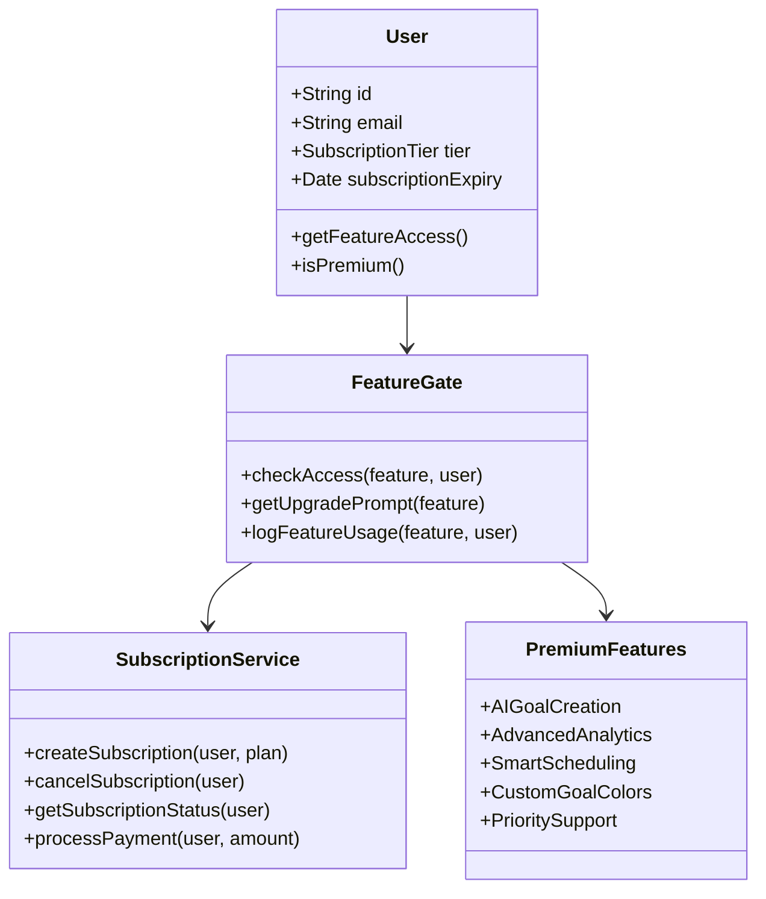
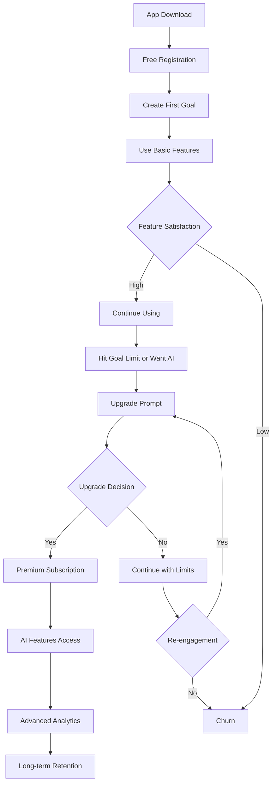
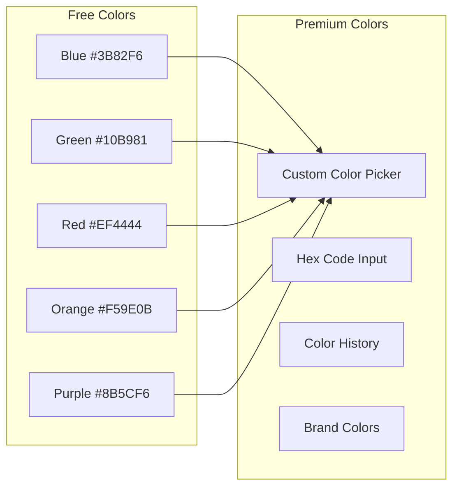

# Momentum App - Updated Premium vs Free Feature Strategy

## 🎯 Feature Tiers Overview

## 📊 Feature Comparison Matrix

| Feature Category | Free Tier | Premium Tier |
|------------------|-----------|--------------|
| **Goal Management** | 3 active goals, basic creation | Unlimited goals, AI creation |
| **AI Features** | None | Full AI assistant & coaching |
| **Analytics** | Basic progress bars | Advanced insights & reports |
| **Calendar** | Month view only | Month view + smart scheduling |
| **Notifications** | Local, basic timing | Smart notifications + push |
| **Goal Colors** | 5 predefined colors | Custom color picker |
| **Themes** | Dark/Light only | Dark/Light + custom goal colors |
| **Support** | Community support | Priority support |

## 🎯 User Journey Flow

## 💰 Pricing Strategy

## 🚀 Implementation Phases

### Phase 1: Core Premium Features

### Phase 2: Enhanced Experience

## 🎯 Feature Access Control

## 📱 Feature Implementation Architecture

## 🎯 Conversion Funnel

## 🎨 Goal Color Customization Strategy

### Free Tier Colors
- **5 Predefined Colors**: Blue, Green, Red, Orange, Purple
- **Fixed Color Palette**: Users can choose from preset options
- **Basic Visual Organization**: Simple color coding for goals

### Premium Tier Colors
- **Custom Color Picker**: Full spectrum color selection
- **Hex Code Input**: Advanced users can input exact colors
- **Color History**: Save frequently used custom colors
- **Brand Colors**: Support for company/brand color schemes

## 📊 Success Metrics

### Free Tier Metrics
- **Goal Creation Rate**: Track how quickly users create their first 3 goals
- **Feature Usage**: Monitor which free features are most used
- **Time to Goal Limit**: Measure how long until users hit the 3-goal limit
- **Color Usage**: Track which predefined colors are most popular
- **Retention Rate**: Track 7-day, 30-day retention for free users

### Premium Tier Metrics
- **Conversion Rate**: Free to premium conversion percentage
- **AI Feature Adoption**: Usage of AI goal creation and chat
- **Advanced Feature Usage**: Analytics, smart scheduling adoption
- **Custom Color Usage**: How many users customize goal colors
- **Subscription Retention**: Monthly churn rate for premium users

### Revenue Metrics
- **Monthly Recurring Revenue (MRR)**: Track subscription revenue
- **Average Revenue Per User (ARPU)**: Revenue per user calculation
- **Customer Lifetime Value (CLV)**: Long-term revenue per user
- **Churn Rate**: Monthly subscription cancellation rate

## 🎯 Marketing Positioning

### Free Tier Value Proposition
- "Start your goal-tracking journey"
- "Perfect for personal productivity"
- "Core features included forever"
- "5 beautiful goal colors included"

### Premium Tier Value Proposition
- "Unlock AI-powered goal creation"
- "Unlimited goals & advanced insights"
- "Customize your goals with any color"
- "Smart scheduling & analytics"
- "Professional-grade productivity tools"

## 🔧 Technical Implementation Notes

### Feature Gating
- Implement feature flags for premium features
- Use subscription status to control access
- Graceful degradation for expired subscriptions
- Clear upgrade prompts with value messaging

### Goal Color System
- **Free Tier**: Array of 5 predefined hex colors
- **Premium Tier**: Full color picker component
- **Database**: Store color as hex string in goals table
- **UI**: Color picker modal for premium users

### Analytics Tracking
- Track feature usage by subscription tier
- Monitor conversion funnel metrics
- A/B test upgrade prompts and pricing
- Measure feature adoption rates
- Track color customization usage

### Payment Integration
- Stripe/Apple Pay/Google Pay integration
- Subscription management
- Proration handling for upgrades
- Grace period for failed payments

## 🎯 Key Premium Features Summary

### Core Premium Features
1. **AI Goal Creation** - Conversational AI assistant for goal planning
2. **Unlimited Goals** - Remove the 3-goal limit
3. **Advanced Analytics** - Progress insights and reports
4. **Smart Scheduling** - AI-optimized task placement
5. **Custom Goal Colors** - Full color picker for personalization
6. **Priority Support** - Faster customer support response
7. **Early Access** - New features before free users

### Removed Features (Simplified Strategy)
- ~~Multiple Calendar Views~~ - Keep calendar simple
- ~~Cloud Sync~~ - Focus on core features first
- ~~Data Export~~ - Not essential for initial launch

This streamlined approach focuses on the most valuable premium features that provide clear differentiation and upgrade incentives while keeping the implementation manageable.
